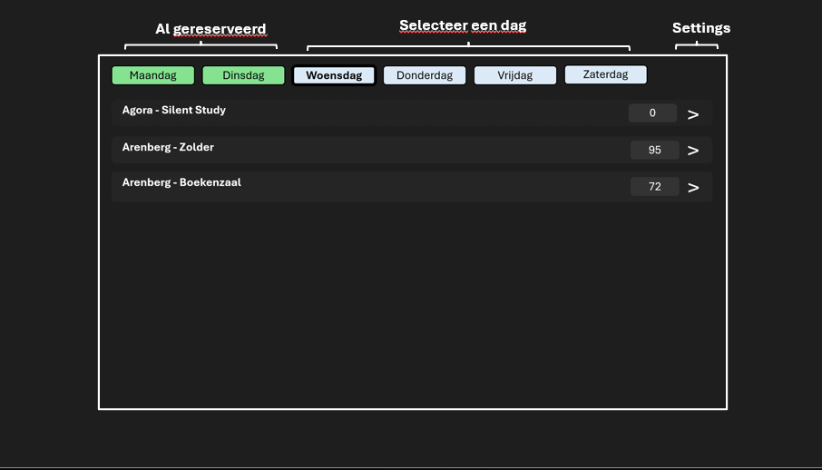
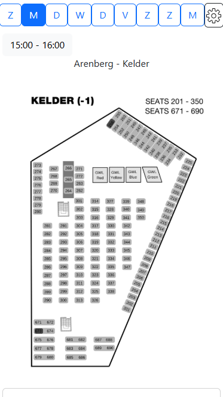

# KURT-PRO

## About

KURT-PRO is a webbrowser extension that aims to provide students a better experience when using the KULeuven KURT reservation system. Below are the key features of KURT-PRO:

- Sort seats by library and room, instead of by number
- A map of available seats

## How to install

**Chrome**: Go to releases, download the latest `KURT_PRO_chrome_extention.zip`, and import this in your chrome extention manager.

**Safari**: You will need third party software for this. Download `userscript` from the appstore. In releases, download the latest `KURT_PRO_userscript.user.js` and import this `.js` file in userscripts.

After installing, go to `kurt3.ghum/kuleuven.be`. You should see a button at the top of the page to switch to KURT_PRO. Clicking this button will redirect you to the KURT_PRO page. It is adviced to create a shortcut to this url.